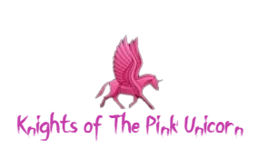

# Knight-of-The-Pink-Unicorn
https://dengian.github.io/Knights-of-The-Pink-Unicorn/

A company where you can hire a hunter
that helps you get rid of paranormal beings in your life!
going from:
1. haunted places
2. possesion
3. and everything else you can imagine

### for a preview!
<a href="file:///C:/Users/glenn/Desktop/becode/Knights-of-The-Pink-Unicorn/images/preview.png">
look no further!</a>

---
This project/company was made as an exercise for our junior full stack webdeveloper course,
as a first group project. Our goal with this project were to following:
* learning how to collaborate on git/github
* linking multiple pages with multiple inputs and style sheets
* failing in almost everything and learning from this
* showing (maybe to ourselves the most) what we've learned so far
---

<footer>
Created by <a href="https://github.com/DenGian">Ian</a>
<a href="https://github.com/VladBurlacu">Vlad</a>
& <a href="https://github.com/Glinchflash">Glenn</a>
</footer>